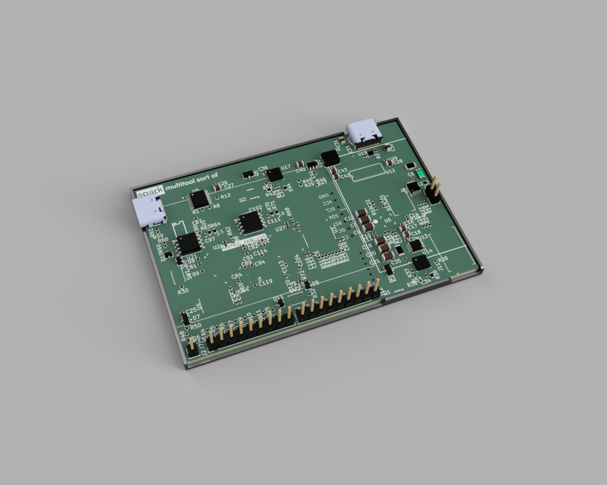

# spark

an electronic multitool in the shape of a card

# Features

- dual RP2350As (one logic analyzer & power, other LVGL & inputs)
- 8 channel logic analyzer
- very slow ADC
- GPIO
- up to 20V 3A power output

# Files

- `/case`: The CAD for the case for the PCB. Includes a Fusion archive file, step, and stl file
- `/firmware`: Includes the firmware for both MCUs for this project. `/main` is in Rust and handles the logic analyzer, and `/secondary` is the input and LVGL C files
- `/PCB`: The PCB files for this project. The producton/gerber files are in `/production`
- `/media`: The screenshots/renders

## More Screenshots

## Bill of Materials

You can also view the BOM in `BOM.csv`

| Name                   | Description                                                           | Link                                                                     |
| ---------------------- | --------------------------------------------------------------------- | ------------------------------------------------------------------------ |
| RP2350A                | Dual-core ARM Cortex-M33 / RISC-V microcontroller 30 GPIO QFN-60 (x2) | https://jlcpcb.com/partdetail/RaspberryPi-RP2350A/C42411118              |
| W25Q128JVSIQ           | 128Mbit SPI NOR Flash SOIC-8 (x2)                                     | https://jlcpcb.com/partdetail/WinbondElec-W25Q128JVSIQ/C97521            |
| APS6404L-SQN-SN        | 64Mbit QSPI PSRAM SOP-8 (x1)                                          | https://jlcpcb.com/partdetail/APMemory-APS6404L_SQNSN/C5360304           |
| INA226AIDGSR           | 36V 16-bit I2C Power Monitor TSSOP-10 (x2)                            | https://jlcpcb.com/partdetail/TexasInstruments-INA226AIDGSR/C49851       |
| SN74LVC8T245PWR        | 8-bit dual-supply level shifter TSSOP-24 (x2)                         | https://jlcpcb.com/partdetail/TexasInstruments-SN74LVC8T245PWR/C27643    |
| IP2721                 | USB PD sink controller TSSOP-16 (x1)                                  | https://jlcpcb.com/partdetail/INJOINIC-IP2721/C603176                    |
| MP8859GQ-0000-Z        | Programmable synchronous buck converter QFN-16 (x1)                   | https://jlcpcb.com/partdetail/MPS-MP8859GQ_0000Z/C5439043                |
| SL2.1A                 | 4-port USB 2.0 hub controller SO-16 (x1)                              | https://jlcpcb.com/partdetail/Corechips-SL21A/C192893                    |
| TPS26630RGER           | 45V 5.5A eFuse with reverse polarity VQFN-24 (x2)                     | https://jlcpcb.com/partdetail/TexasInstruments-TPS26630RGER/C1850276     |
| USBLC6-2P6             | USB ESD protection SOT-666 (x1)                                       | https://jlcpcb.com/partdetail/STMicroelectronics-USBLC62P6/C15999        |
| AP63203WU-7            | 3.3V 2A synchronous buck converter TSOT-23-6 (x1)                     | https://jlcpcb.com/partdetail/DiodesIncorporated-AP63203WU7/C780769      |
| ABM8-272-T3            | 12MHz crystal oscillator RPi recommended SMD (x3)                     | https://jlcpcb.com/partdetail/AbraconLlc-ABM8_272T3/C20625731            |
| AOTA-B201610S3R3-101-T | 3.3uH polarised inductor for RP2350 DVDD SMPS 2016 (x2)               | https://jlcpcb.com/partdetail/AbraconLlc-AOTA_B201610S3R3_101T/C42411119 |
| SRP4020TA-4R7M         | 4.7uH 2.6A shielded power inductor for MP8859 (x1)                    | https://jlcpcb.com/partdetail/BOURNS-SRP4020TA4R7M/C2041623              |
| SPM6530T-4R7M          | 4.7uH TDK power inductor for USB PD path (x1)                         | https://jlcpcb.com/parts/componentSearch?searchTxt=SPM6530T-4R7M         |
| STT6N3LLH6             | N-channel 30V 6A MOSFET SOT-23-6 (x2)                                 | https://jlcpcb.com/partdetail/C3021100                                   |
| BSS138                 | N-channel 50V 0.2A logic-level MOSFET SOT-23 (x2)                     | https://jlcpcb.com/partdetail/Onsemi-BSS138/C52895                       |
| BAT54W                 | 30V 200mA dual Schottky diode SOT-323 (x4)                            | https://jlcpcb.com/partdetail/ZRE-BAT54W/C779673                         |
| BAT54S                 | 30V 200mA dual Schottky diode SOT-23 (x1)                             | https://jlcpcb.com/partdetail/hongjiacheng-BAT54S/C7420333               |
| PESD5V0U1BL            | 5V ESD protection diode SOD-882 (x19)                                 | https://jlcpcb.com/partdetail/TECHPUBLIC-PESD5V0U1BL/C2827663            |
| 1206L050YR             | 6V 0.5A/1A resettable fuse 1206 (x1)                                  | https://jlcpcb.com/parts/componentSearch?searchTxt=1206L050YR            |
| TYPE-C-31-M-12         | USB Type-C receptacle SMD 16-pin (x2)                                 | https://jlcpcb.com/partdetail/Korean_HropartsElec-TYPE_C_31_M12/C165948  |
| RLS12FTCR020           | 20mΩ 1W current sense resistor 1206 (x2)                              | https://jlcpcb.com/parts/componentSearch?searchTxt=RLS12FTCR020          |
| 0402WGF1003TCE         | 100kΩ 1% 0402 resistor (x5)                                           | https://jlcpcb.com/partdetail/UniOhm-0402WGF1003TCE/C25803               |
| 0402WGF5101TCE         | 5.1kΩ 1% 0402 resistor for USB CC (x2)                                | https://jlcpcb.com/partdetail/UniOhm-0402WGF5101TCE/C27091               |
| 0402WGF470JTCE         | 47Ω 5% 0402 resistor (x16)                                            | https://jlcpcb.com/partdetail/UniOhm-0402WGF470JTCE/C25900               |
| 0402WGF1502TCE         | 15kΩ 1% 0402 resistor (x1)                                            | https://jlcpcb.com/partdetail/UniOhm-0402WGF1502TCE/C25749               |
| 0402WGF4701TCE         | 4.7kΩ 1% 0402 resistor (x6)                                           | https://jlcpcb.com/partdetail/UniOhm-0402WGF4701TCE/C25905               |
| 0402WGF2202TCE         | 22kΩ 1% 0402 resistor (x1)                                            | https://jlcpcb.com/partdetail/UniOhm-0402WGF2202TCE/C25888               |
| 0402WGF0000TCE         | 0Ω 0402 jumper resistor (x3)                                          | https://jlcpcb.com/partdetail/UniOhm-0402WGF0000TCE/C17168               |
| 0402WGF1002TCE         | 10kΩ 1% 0402 resistor (x7)                                            | https://jlcpcb.com/partdetail/UniOhm-0402WGF1002TCE/C25744               |
| 0402WGF1001TCE         | 1kΩ 1% 0402 resistor (x4)                                             | https://jlcpcb.com/partdetail/UniOhm-0402WGF1001TCE/C21190               |
| 0603WAF6201T5E         | 6.2kΩ 1% 0603 resistor ILIM for TPS26630 (x1)                         | https://jlcpcb.com/parts/componentSearch?searchTxt=0603WAF6201T5E        |
| 0402WGF4703TCE         | 470kΩ 1% 0402 resistor UVLO divider (x1)                              | https://jlcpcb.com/partdetail/26533-0402WGF4703TCE/C25790                |
| 0402WGF2402TCE         | 24kΩ 1% 0402 resistor UVLO divider (x3)                               | https://jlcpcb.com/partdetail/UniOhm-0402WGF2402TCE/C25769               |
| 0603WAF1603T5E         | 160kΩ 1% 0603 resistor UVLO network (x1)                              | https://jlcpcb.com/partdetail/UniOhm-0603WAF1603T5E/C22813               |
| FRC0603F3571TS         | 3.57kΩ 1% 0603 resistor ILIM for TPS26630 (x1)                        | https://jlcpcb.com/partdetail/C2933206                                   |
| 0402WGF1503TCE         | 150kΩ 1% 0402 resistor PGTH divider (x1)                              | https://jlcpcb.com/partdetail/UniOhm-0402WGF1503TCE/C25755               |
| 0402WGF8201TCE         | 8.2kΩ 1% 0402 resistor ADC input protection (x1)                      | https://jlcpcb.com/partdetail/UniOhm-0402WGF8201TCE/C25924               |
| 0402WGF3303TCE         | 330kΩ 1% 0402 resistor UVLO network (x1)                              | https://jlcpcb.com/partdetail/UniOhm-0402WGF3303TCE/C25778               |
| 0402WGF3003TCE         | 300kΩ 1% 0402 resistor OVP divider (x1)                               | https://jlcpcb.com/partdetail/UniOhm-0402WGF3003TCE/C25774               |
| 0402WGF330JTCE         | 33Ω 5% 0402 resistor USB D+/D- (x2)                                   | https://jlcpcb.com/partdetail/UniOhm-0402WGF330JTCE/C25105               |
| 0603WAF270JT5E         | 27Ω 5% 0603 resistor USB D+/D- (x4)                                   | https://jlcpcb.com/partdetail/UniOhm-0603WAF270JT5E/C25190               |
| CL05B104KB54PNC        | 100nF 50V X7R 0402 decoupling capacitor (x38)                         | https://jlcpcb.com/parts/componentSearch?searchTxt=CL05B104KB54PNC       |
| CL05A105KA5NQNC        | 1uF 25V X5R 0402 capacitor (x7)                                       | https://jlcpcb.com/parts/componentSearch?searchTxt=CL05A105KA5NQNC       |
| C3216X5R1E476MTJ00E    | 47uF 25V X5R 1206 bulk capacitor (x6)                                 | https://jlcpcb.com/parts/componentSearch?searchTxt=C3216X5R1E476MTJ00E   |
| CGA2B2X7R1E223KT0Y0F   | 22uF 25V X7R 0402 capacitor (x1)                                      | https://jlcpcb.com/parts/componentSearch?searchTxt=CGA2B2X7R1E223KT0Y0F  |
| 0402CG101J500NT        | 100pF C0G/NP0 0402 capacitor (x1)                                     | https://jlcpcb.com/parts/componentSearch?searchTxt=0402CG101J500NT       |
| 0402B223K500NT         | 22nF 50V 0402 capacitor (x1)                                          | https://jlcpcb.com/parts/componentSearch?searchTxt=0402B223K500NT        |
| CL21A106KAYNNNE        | 10uF 25V X5R 0805 capacitor (x7)                                      | https://jlcpcb.com/parts/componentSearch?searchTxt=CL21A106KAYNNNE       |
| CL21A226MAQNNNE        | 22uF 25V X5R 0805 capacitor (x2)                                      | https://jlcpcb.com/parts/componentSearch?searchTxt=CL21A226MAQNNNE       |
| CL05A475MP5NRNC        | 4.7uF 10V X5R 0402 capacitor (x8)                                     | https://jlcpcb.com/parts/componentSearch?searchTxt=CL05A475MP5NRNC       |
| 0402CG150J500NT        | 15pF 50V C0G/NP0 0402 crystal load capacitor (x4)                     | https://jlcpcb.com/parts/componentSearch?searchTxt=0402CG150J500NT       |
