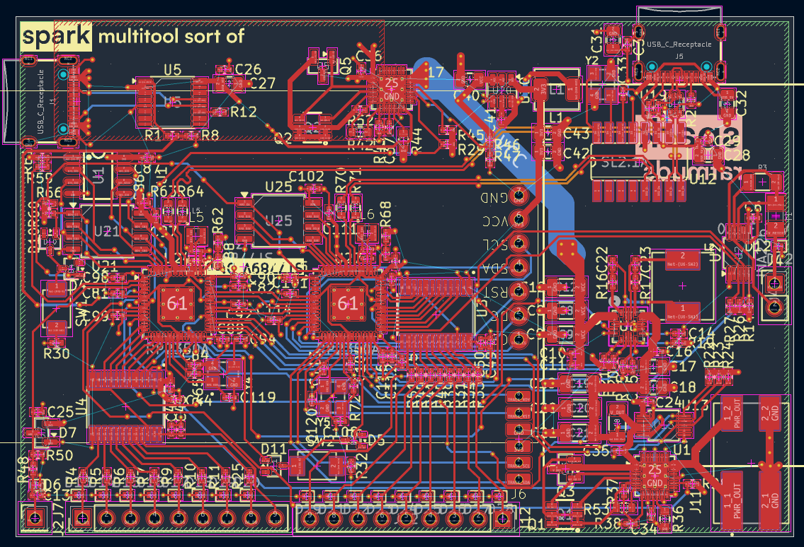

# spark

an electronic multitool in the shape of a card

# features
- dual RP2350As (one logic analyzer & power, other LVGL & inputs)
- 8 channel logic analyzer
- very slow ADC
- GPIO
- up to 20V 3A power output